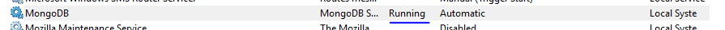

# twitterclone-server

**Twitter mobile app clone (server side) using nodeJS, Express,mongoose, graphql, apollo-server-express, jsonwebtoken etc (on Windows)**

**#Steps: Installation**
1. git clone https://github.com/manojkmishra/twitterclone-server.git
2. npm install 
3. start mongoDB server on your PC
4. yarn dev  (yarn can be downloaded from https://yarnpkg.com/latest.msi)

5. Uncomment line number 39 and 46 from /src/index.js and run the server again using yarn dev. MongoDB  will be updated with fake tweets. Then comment these lines again.

6. Download and install GraphiQL from https://github.com/skevy/graphiql-app/releases

**#Steps: Development Phase**
8. [Initial commit](https://github.com/manojkmishra/twitterclone-server/commit/8c93a136bd475b8af4507af6a21ae881d1dd6c69 "Initial commit")

PS C:\RNTWITTER\server> yarn init 
PS C:\RNTWITTER\server> git init
PS C:\RNTWITTER\server> git add .
PS C:\RNTWITTER\server> git commit -m "Initial commit"
PS C:\RNTWITTER\server> git remote add origin https://github.com/manojkmishra/twitterclone-server.git
PS C:\RNTWITTER\server> git push -u --force origin master

2. [express and babel installed- server running](https://github.com/manojkmishra/twitterclone-server/commit/c41c34df6f452227d53d8a3eee22ce9e195caf90 "express and babel installed- server running")

PS C:\RNTWITTER\server> yarn add express body-parser cross-env
PS C:\RNTWITTER\server> yarn add babel-plugin-transform-object-rest-spread babel-cli babel-preset-env

  

-----------create folder----------------/src-------inside create------------------index.js

import express from 'express';

import bodyParser from 'body-parser';

const app = express();

const PORT = process.env.PORT || 3000;

app.use(bodyParser.json()); //midleware

app.listen(PORT, err =>

{ if (err) { console.error(err); }

else { console.log(`App listen to port: ${PORT}`); }

});

  

--------create/.babelrc--------------because nodejs--does not know es6---so now tell babel--that node 6.10 is used

{

"presets": [ [ "env", { "targets": { "node": "6.10" } } ] ],

"plugins": [ [ "transform-object-rest-spread", { "useBuiltIns": true } ] ]

}

--------------------in package.json------------add script-----to tell node that babel-node will handle if----yarn dev

{

"name": "server",

"version": "1.0.0",

"main": "index.js",

"author": "manojkmishra",

"license": "MIT",

"scripts": {

"dev": "cross-env NODE_ENV=dev babel-node src/index.js"

},

"dependencies": {

"babel-cli": "^6.26.0",

"babel-plugin-transform-object-rest-spread": "^6.26.0",

"babel-preset-env": "^1.7.0",

"body-parser": "^1.18.3",

"cross-env": "^5.1.6",

"express": "^4.16.3"

}

}

---------------------yarn dev----

PS C:\RNTWITTER\server> yarn dev

yarn run v1.3.2

$ cross-env NODE_ENV=dev babel-node src/index.js

App listen to port: 3000

-----------------------------------PS C:\RNTWITTER\server> yarn add -D nodemon-----------------------------

"scripts": {

"dev": "cross-env NODE_ENV=dev nodemon --exec babel-node src/index.js"

},

  

---so now---------nodemon----handles the server and changes happens on runtime--if we change even the port in /src/index.js

PS C:\RNTWITTER\server> yarn dev

yarn run v1.3.2

$ cross-env NODE_ENV=dev nodemon --exec babel-node src/index.js

[nodemon] 1.17.5

[nodemon] to restart at any time, enter `rs`

[nodemon] watching: *.*

[nodemon] starting `babel-node src/index.js`

App listen to port: 3000

[nodemon] restarting due to changes...

[nodemon] starting `babel-node src/index.js`

App listen to port: 3001

----------------install mongo------------create--folder /src/config-----inside-------constants.js----------db.js---------------

PS C:\RNTWITTER\server> yarn add mongoose--------------api---to talk to mongodb

-----------/src/config/constatns.js

export default

{ PORT: process.env.PORT || 3000,

DB_URL: 'mongodb://localhost/tweet-development',

};

<table>

<tr>

<td></td>

</tr>

</table>

-----------/src/config/db.js
